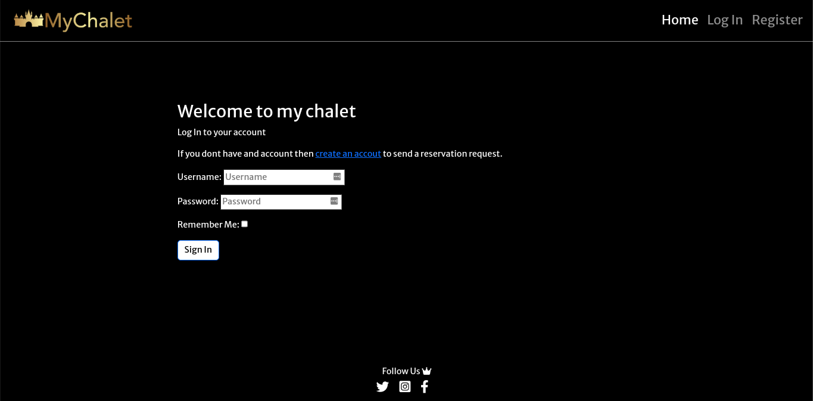
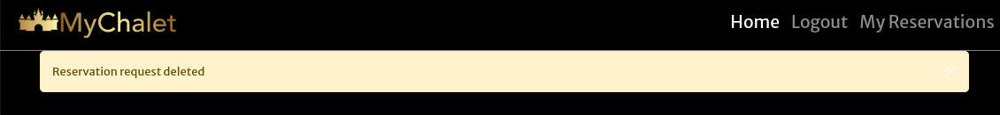

# My Chalet

## Introduction

My chalet is a fictional website designed for travel lovers. The purpose was to enhance user experience by gathering a list of the most exclusive chalets available in Italy. A user can quickly find the most requested and famous mini hotels, just by visiting the site and send a request for availability for one night stay.

## Live Site

Please find the live site [HERE](https://my-chalet.herokuapp.com/)

## Github Repository

The Repository can be found [HERE](https://github.com/aimansae/my-chalet)

## Table Of Contents
+ [Introduction](#introduction "Introduction")
    + [Live-site](#live-site "Live Site")
    + [Github-repository](#github-repository "Github Repository")
+ [UX](#ux "UX")
  + [Scope](#scope "Scope")      
  + [User Stories](#user-stories "User Stories")   
    + [First Time User](#as-a-first-time-user "As a first time user")   
    + [Existing User](#as-an-existing-user "As an existing user")  
    + [Admin](#as-a-site-creator-admin "As a site creator/admin") 
  + [Agile Methodology](#agile-methodology "Agile Methodology")
  + [Design](#design "Design")
    + [Wireframes](#wireframes "Wireframes")
    + [Database Schema](#database-schema "Database Schema") 
    + [Color Schema](#color-schema "Color Schema") 
    + [Fonts](#fonts "Fonts") 
+ [Features](#features "Features")
  + [Navbar](#Navbar "Navbar") 
  + [Footer](#footer "Footer")
  + [Login Page](#login-page "Login Page") 
  + [Fonts Page](#signup-page "Signup Page") 
  + [HomePage](#fonts "Fonts") 
  + [Description Page](#description-page "Description Page") 
  + [Reservation Page](#reservation-page "Reservation Page") 
  + [My Reservation Page](#my-reservations "My Reservations Page") 
  + [Edit Reservation ](#edit-reservation "Edit Reservation ") 
  + [Delete Reservation  ](#delete-reservation "Delete Reservation ") 
  + [Future Features](#future-features "Future Features") 
+ [Testing](#testing "Testing")
  + [Validation Testing](#validation-testing "Validation Testing")
   + [HTML Validation](#html-validation "HTML Validation")
   + [CSS Validation](#css-validation "CSS Validation")
   + [Python Validation](#python-validation "Python Validation")
   + [Lighthouse Report](#lighthouse-report "Lighthouse Report")
  + [Manual Testing](#manual-testing "Manual Testing")
+ [Bugs](#bugs "Bugs")
+ [Technologies used](#technologies-used "Technologies used")
  + [Frameworks and libraries](#frameworks-and-libraries "Frameworks and libraries")
+ [Additional Resources](#additional-resources "Additional Resources")
+ [Development](#Development "Development")
+ [Deployment](#deployment "Deployment")

## UX(User Experience)

### Scope:

The overall purpose of the website is to spare users online long researching  for the best chalet for a special occasion. Users should be able to find the best options available in the Country (Italy) , in a timely manner,  by visiting the website and being able to consult details regarding the chosen option and ultimately send a reservation request directly from the website. Therefore the purpose is clear and immediate.

### [User Stories](https://github.com/users/aimansae/projects/5/views/1):

### As a first time user:

- I can [access](https://github.com/aimansae/my-chalet/issues/1) the website and see all the chalets the site has selected, ranked as the best ones. The site should be ituitive, immediate and provide all significant details about a chalet in the homepage.

- I can [choose](https://github.com/aimansae/my-chalet/issues/2) the chalet I like and read detailed information before submitting a reservation request. (*future features to be included here..*)

- I can [send](https://github.com/aimansae/my-chalet/issues/3) a reservation request selecting the desired date. (*future features to be included here..*)

- I can [register](https://github.com/aimansae/my-chalet/issues/4) so I can send a registraton request.

- I can [access](https://github.com/aimansae/my-chalet/issues/5) my reservations so that I can change or delete them

- I can [edit](https://github.com/aimansae/my-chalet/issues/6) my reservations so that I can change them.

- I can [delete](https://github.com/aimansae/my-chalet/issues/7) so I can remove a reservation request I submitted. 

### As an existing user:

- I can log in to my exixting account, consult the requests I sent,  change or delete them.
- I can submit more reservation requests for the desired chalet

### As a site creator-admin:

- I want to be able to have access to all request users submitted
- I want to be able to delete or edit user requests
- I want all the data successfully stored in my internal database

### Agile Methodology

The development was made using the principles of agile methodology. User stories through github [Kanban](https://github.com/users/aimansae/projects/5) were created to ensure project delivery. Issues were prioritized using labels, must do and future features. All must have features were achieved successfully in a timely manner.

## Design

### Wireframes
The site was created based on a first skeleton. The main idea was to create 6 cards on homepage showing the chalet options, and then by clicking on 'Reserve button' a detailed description is available. Authenticated users can submit a reservation request, while non registered or logged in users will have to first make an account or login. CRUD functionality was taken into account, therefore a user can manage the reservation by changing data sent in the form or delete the request.

<strong>Wireframes</strong>

 

HomePage:

Chalet Details

Login Signup

Send Reservation

My Reservations

Edit-Delete-logout Confirmation

 

### Database Schema

Database is created through 2 class based models:

ChaletList: presents the main details regarding all the chalet available. Currently there are 6 available options, containing chalet name , location, description, image and price info.
Admin can obviously add more chalets, delete or edit information directly via admin panel.

MakeReservation: contains a form requesing for user details in order to submit a reservation request: full name, email, phone, number of guests and date. A foreign key is used for user, and selectd_chalet linking to ChaletList Model, to retrieve which chalet user selected.

<strong>Database Schema</strong>

 

 

### Color Schema

A background of black was used as main color to provide an elegant and fancy view and contrast all the eye-catching chalet images. 

### Fonts

The main font used is [Merriweather Sans](https://fonts.google.com/specimen/Merriweather+Sans)', while all main H1 headings are styled with [Raleway Font](https://fonts.google.com/specimen/Raleway). The selection is made to keep the elegant and modern look of the website.

## Features

### Navbar
The navbar is recurrent in all the pages. It contains the customized logo and links to navigate throught the page: Home, Login, Logout and My Reservation page, only if the user is authenticated.

If user is not logged in:

If user is logged in, login link will disappear from the navigation and Log out page will be shown instead, alongside with my reservations page:

### Footer
The footer is recurrent in all the pages as well. It contains links to social media for My Chalet website which open in a different tab.

### Login Page

Login page presents a form so existing users can insert their credentials and log in to send a reservation request or consult the ones they already submitted. 
If user doesn't have an account, they will be shown a link that directs them to signup page.

If user wants to logout a confirmation request will be shown, to confirm if the user wants actually to log out or return to the main page

### Sign Up Page

Sign up page allows a non existing user to create an account in order to send a request for reservation. If they already have an account a link is shown to direct them to login page.

### Homepage 
The home page contains a small description specifying the purpose of the site and presents appealing images showing all the 6 Chalets that were chosen as the best ones. 
The user can click on button 'Reserve' an will be directed to another page showing more details regarding the selected chalet.

### Description Page
Once the user clicks on the desired chalet, a new page opens showing a detailed description and services the chalet offers, alonside with the price and a button to send a reservation request.

### Reservation page

The reservation page form requires the user to insert their details and the date desired so that they can submit the request for reservation. For future feaures, the calendar will show the available dates and anfter sending the request a confirmation email will be sent to the user, providing a better user experience.

### My Reservation Page

For logged in users, my reservation page allows them to see all the reservation requests they sent. In addition to that users are able to change or delete a request.

### Edit Reservation 

If a user wants to change reservation, he can click on 'change' button and change the details as preferred. A confirmation message will be shown after the request has been updated.

### Delete Reservation 

A user is also able to delete their reservation and modal requesting double confirmation will be shown.

## Future Features:

  - [Reservation confirmation](https://github.com/aimansae/my-chalet/issues/9): once selected the desired date, an email will be sent to the user regarding the availability.

  - [View more images](https://github.com/aimansae/my-chalet/issues/10): once the user will select click on a specific chalet to check the details, more images will be shown so they can consult the interior and all the services the structure provides.

  - [Consult Reviews](https://github.com/aimansae/my-chalet/issues/11): user will be able to check and post reviews regarding a specific chalet.

  - [Check Availability](https://github.com/aimansae/my-chalet/issues/12): while the user will be selecting the date a new calendar will appear showing availability for that specific date

  - [Overbooking/Double Booking](https://github.com/aimansae/my-chalet/issues/13): important feature to implement as the admin will be able to show information regarding double bookings, overbooking and in addition to that will implement code to limit the number of reservation requests a user van send.

  - Password Reset: a user will be able to reset their password, in case forgotten

  - Prefill forms with data provided during registration process, so Users will not have to input the same data all the time. 

  - While editing, user will be able to change the chalet itself, and not just the form input data.

## Testing

### Validation Testing

### HTML Validation

HTML validation was made through [W3 HTML Validator](https://bit.ly/3PFwFJx) through Chrome View Page Source.
The test passed with 0 errors.

### CSS Validation

Css Validation passed throug [W3C CSS Validator](https://jigsaw.w3.org/css-validator/) showing 0 errors

### Python Validation

Python testing was done through pycodestyle, showing no errors.
During testing some errors were identified:
- Extra whitespace was deleted
- Some Indentation was corrected
- All lines adjusted to <80 characters. In views.py the message 'Thank you, your reservation request is submitted, we will contact you shortly!!' is the only code exceeding the limit.

### LightHouse Report: 
Lighthouse report was done for all site pages and presented different suggestions to enhance website accessibility.

 - aria-* attributes do not match their roles: fixed this by changing aria'label description on 'A tags' and not on icons
 - logo image did not have alt text: added it 
 

### Manual testing

Manual testing was conducted to check website functionality and features.

<strong>Show Tests</strong>

 

|   | Pass/Fail |
| ------------- | :----: |
| My Chalet Logo directs to homepage correctly  |  Pass |
| Navbar Home link directs to homepage correctly  |  Pass |
| Navbar Login link directs to login page correctly  |  Pass |
| Navbar Register link directs to sign up page correctly  |  Pass |
| Footer social media links open the relative social media in a new tab correctly  |  Pass |
| Location links open google maps links in a different tab correctly  |  Pass |
| Successfully logged in and registered message shown after user logs in  |  Pass |

|   | Pass/Fail |
| ------------- | :----: |
| Successfully signed out message is shown correctly  |  Pass |

|   | Pass/Fail |
| ------------- | :----: |
| Form fields are validated correctly, empty or incorrect fields show warnings  |  Pass |
| Reserve button on Homepage opens the selected chalet page showing all the relavant details correctly  |  Pass |
| Reserve button on Chalet Detail page shows the form to send a reservation request correctly  |  Pass |
| Upon selecting the chalet, the form shows the related chalet name and prices correctly  |  Pass |
| Form automatically prefills on load date from tomorrow  correctly, as intended  |  Pass |

|   | Pass/Fail |
| ------------- | :----: |
| If a user selects past date a warning message is shown correctly |  Pass |

|   | Pass/Fail |
| ------------- | :----: |
| If a user selects today's date a warning message is shown correctly |  Pass |

|   | Pass/Fail |
| ------------- | :----: |
| If form is correct and user sends reservation request, the message stating reservation sent is shown correctly  |  Pass |

|   | Pass/Fail |
| ------------- | :----: |
| If authenticated user updates the reservation, the confirmation message is shown correctly  |  Pass |

|   | Pass/Fail |
| ------------- | :----: |
| If authenticated user wants to delete the reservationthe confirmation modal is shown correctly and deletion confirm message appears |  Pass |

|   | Pass/Fail |
| ------------- | :----: |
| Once the user delets the request, he is correctly directed back to my reservations page  |  Pass |
| If user has no reservations yet and opens my reservation page, the message stating 'No Reservations' is shown correctly |  Pass |

|   | Pass/Fail |
| ------------- | :----: |
| If non authenticated users try to access both my_reservations page or edit_reservation page, a warning appear, requesting them to be regisered or logged in to access the page|  Pass |

|   | Pass/Fail |
| ------------- | :----: |
| When new user is created, this is correctly shown on admin panel|  Pass |

|   | Pass/Fail |
| ------------- | :----: |
| When a new user submits a reservation request, edits, deletes, this is correctly shown on admin panel|  Pass |

## BUGS

<strong>Show Bugs</strong>

 
1.While initially deploying to heroku push failed with the following error: 

*Failed to build backports.zoneinfo*  

Detaild ERROR: Could not build wheels for backports.zoneinfo, which is required to install pyproject.toml-based projects
!     Push rejected, failed to compile Python app.
Seps taken:
 - Checked Python Version Using Python -V command 
 - created  runtime.txt file in root directory and add “python-3.8.10”
 - committed and push again
Deployed, but another error appeard: 

Requested runtime 'python-3.8.10' is not available for this stack (heroku-22).
!     For supported versions, see: https://devcenter.heroku.com/articles/python-support
!     Push rejected, failed to compile Python app.
Thanks to tutor help, ran the following commands to fix:
 - Login to the Heroku CLI via the terminal: heroku login -i
 - run command: heroku stack:set heroku-20 -a my_app_name

Deployed again >> FIXED

2. while running command python3 manage.py faced Django error
CSRF verification failed. Request aborted
- Fixed by inserting the updated SRF_TRUSTED_ORIGINS = ['https://8000-aimansae-mychalet-cmwev90wvp8.ws-eu79.gitpod.io'] link

3. Homepage cards text was not alligned to each other, inserted Bootstrap class 'justify-content-between' to resolve.

4. Django form date validation presented various Issues. Validation error messages were not showing:
 - Imported from dango validators to fix it See [Validator Documentation](https://docs.djangoproject.com/en/4.1/ref/validators/)
Date did not prefill automatically with future date(tomorrow) as intended:
- Fixed by adding on form.py file, a widget, with an initial value.
5. Django reservation form was not getting the specific chalet that user selected. Inserted another model field on MakeReservation (selected_chalet) with a foreign Key connected to ChaletList Model to access the date and the render it on reservation.html template.

6. Edit view was not rendering due to url error on edit_reservation.html. Initially the code used was , however needed to access the loop variable 'reservation' therefore corrected with the following code 

7. After inserting all chalet images on homepage, the deployment to heroku did not render images correctly because static file was connected wrongly. I had  instead of .

8. Due to   on home.html, chalet cards on medium devices were rendering wrongly. A list of 2, 1, 2,1 was being displayed. Removed the counter loop code as Bootstrap classes were already displaying 2 cards per row. Now on medium devices 2 chalet per row are showing,as intended.

9. Js code for Timeout function presented TypeError: cannot read properties of null (reading 'close'): 
 - checked if element by ID 'msg' was present on html file, 
 - Fixed error with if (messages) statement: setimeout function was requiren only for specific moments, when messages were appearing, therefore if statement resolved the isusue.

## Technologies used

### [HTML5](https://developer.mozilla.org/en-US/docs/Glossary/HTML5)
### [CSS3](https://developer.mozilla.org/en-US/docs/Web/CSS)
### [Python](https://developer.mozilla.org/en-US/docs/Web/CSS)
### [Javascript](https://developer.mozilla.org/en-US/docs/Web/CSS)

## Frameworks and libraries:

- [Django](https://docs.djangoproject.com/en/4.1/): The app is built using Python Django Framework
- [Bootstrap 5](https://getbootstrap.com/): html pages styling and responsive design is achieved using bootstrap

## Additional Resources and Credits:
- [Cloudinary](https://cloudinary.com/i) database: used to store images
- [Baslamiq](https://balsamiq.com/): used for Wireframes
- [Cacoo.com](https://cacoo.com/): used for database diagram representation
- [Am I Responsive](https://ui.dev/amiresponsive): for main picture showind responsivness on different devices
- [Dev Optimize](https://web.dev/optimize-cls/): for suggestion to fix Lighthouse report bugs
- Several youtube videos were consulted for a better Django understanding:
 - [Django Course for Beginners](https://www.youtube.com/watch?v=rHux0gMZ3Eg&ab_channel=ProgrammingwithMosh) 
 - [Database Relationship](https://www.youtube.com/watch?v=wIPHER2UBB4&t=4s&ab_channel=DennisIvy) to render chalet name and price on the form, therefore created selected_chalet field on MakeReservation Model.
 - [Foreign Key](https://bit.ly/3HUriEt) explaination to connect MakeReservation model to ChaletList through selected_chalet field
 - [Django Date Validation](https://joshuahunter.com/posts/formatting-date-fields-in-django/)
 - [Upload Images](https://www.youtube.com/watch?v=O5YkEFLXcRg&t=253s&ab_channel=Codemy.com) to check seting requirements and how to upload imges folter on templates.
 -[Pexel.com](https://www.pexels.com/) used for images
 - A huge credit goes to mentors Martina T. and Rohit S. who helped me with great suggestions, documentation and resources in order to deliver the project respecting the assessment criterias. 
 - Code Institute Tutors were highly consulted, especilly for reservation and edit functionality.
 - Code Institute Slack channel was consulted for advices, error resolution and project ideas.

 ## Development

<strong>Show Development</strong>

 

This project was developed through Gitpod, using the template provided by Code Institute. Every step was documented and pushed thoroughly via GitHub. These are the steps:

Log into [GitHub](https://github.com/)
Open Code Institute [Template](https://github.com/Code-Institute-Org/gitpod-full-template)

- Click on 'Create new Repository'
- Choose adeguate name
- Add a description (optional)
- Make sure the repository is Public
- Click on 'Create Repository from this template'
- Once the page is loaed click on Gitpod to run the workspace

## Deployment

<strong>Show Deployment</strong>

 

The site was created using [GitHub](https://github.com/). Here are the speps taken:

- Sign in to GitHub
- Code Institute Template was used by clicking on 'Use this template' as described above
- Once the repo is created need to install Django and relevant libraries:

### Packages:

- pip3 install 'django' gunicorn
- pip3 install dj_database_url==0.5.0 psycopg2
- pip3 install dj3-cloudinary-storage
- pip3 install django-allauth
- pip3 freeze --local > requirements.txt
- django-admin startproject PROJ_NAME (my_chalet) . (dot to indicate we want to create the project in the current directory)
- python3 manage.py startapp APP_NAME ('my_chalet_site')

In setting.py file:
- in INSTALLED_APPS section: add  the APP_NAME with coma: 'my_chalet_site',

Need migrate the changes to the database by typing in terminal: 
- python3 manage.py migrate

To run the app type in terminal:
- python3 manage.py runserver
- opens site confirming 'Django app successfully created'

## Heroku Deployment and database

Create a database Heroku can access via ElephantSQL:

- Log in to [ElephantSQL.com](https://www.elephantsql.com/) to access your dashboard
- Click on “Create New Instance”
- Set up your plan
- Give the plan a Name (this is commonly the name of the project)
- Select the Tiny Turtle (Free) plan
- the Tags fields can be left blank
- click “Select Region”
- Select a data center near you
- Click on “Review”
- Verify your details and click “Create instance”
- In ElephantSQL dashboard  click on the database instance name for this project
- In the URL section, click the copy icon to copy the database URL(to be copied on Heroku Settings)

**In gitpod:**
- Create new env.py file on top level directory:  env.py
 - in this file add code 'import os'
- Set environment variables:
os.environ["DATABASE_URL"] = "Paste in  DATABASE_URL Link  from ElephantSQL "
- Add in secret key: 
os.environ["SECRET_KEY"] = "Make up your own randomSecretKey"
- type in terminal 'python3 manage.py migrate'

**In setting.py:** 
- connect env.py file by typing:

 import os
 import dj_database_url
 if os.path.isfile('env.py'):
     import env
- replace secret key with:
 SECRET_KEY = os.environ.get('SECRET_KEY')
- Comment out the original DATABASES variable and add:

 DATABASES = {
     'default': dj_database_url.parse(os.environ.get("DATABASE_URL"))
 }
- add Heroku to the ALLOWED_HOSTS in settings.py
- create Procfile withcode : web: gunicorn PROJ_NAME.wsgi
- save file and type:  python manage.py migrate
- commit and push the project to Github

- In ElephantSQL Dashboard:
- Click on 'Browser' tab on the left
- “Table queries” the list will be populated from your Django migrations.

The site is deployed to **Heroku** through the following steps:

- Log in to [Heroku](https://dashboard.heroku.com/apps) or create an account if required.
on home pace e click the button labelled 'New' in the top right corner
- From the drop-down menu select 'Create new app'.
- Choose a unique app name.
- Select the relevant geographical region.
- Click on 'Create App'.

- Go to 'Settings' tab and scroll down to the 'Config Vars' section.
- Click on 'Reveal Config Vars' and enter 'PORT' for the key and '8000' for the value. Then click 'Add'.
- Add CLOUDINARY_URL, DATABSE_URL and SECRET_KEY.

**Connect Heroku** to gitpod:

- Click on the 'Deploy' tab.
- Select as 'Deployment method': 'GitHub'.
- Search and Connect the relevant GitHub repository.
- Under 'Manual deploy' choose the correct branch and click 'Deploy Branch'.

[Back to Top](#table-of-contents)